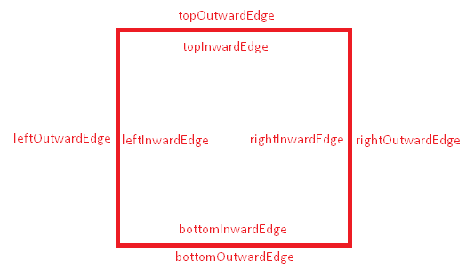

#Dynamic positioning and resizing made easy 

Ever have spent whole day on adjusting X and Y to only discover, that on some specific screen resolution it is still overlapping with something else? Never more!

Pixi-layout is here to make dynamic positioning and resizing easier. 

- Health Bar pinned to left bottom corner and wide to 10% of screen?
```typescript
healthBar.layout = makeLayout(screenArea)
  .x.set(20).fromLeftInwardEdge()   
  .y.set(20).fromBottomInwardEdge()
  .width.set("10%") 
```

- Background covering whole screen?
```typescript
bg.layout = makeLayout()
  .size.cover(screenArea, Align.CENTER)
```

- Logo in top center of the screen, as big as possible, but not higher then 20% of screen?
```typescript
logo.layout = makeLayout(screenArea)
  .x.inCenter()
  .y.set(50).fromTopInwardEdge()
  .width.set(100%)  
  .height.max("20%") 
```

- Button 100px under the logo?
```typescript
button.layout = makeLayout(logo)
  .x.inCenter()
  .y.set(100).fromBottomOutwardEdge()
```

Pixi-layout is working as for now, but it is still more like proof of concept and will be rewritten soon.

# How to use?
 
Works for both pixi v4 and v5.
 
```
npm i pixi-layout 
```

then somewhere 

```typescript
import { pixiLayout, setupPixiLayout } from "pixi-layout"
setupPixiLayout(app.renderer);
```

and you can use `layout` property on any view

```typescript
import { makeLayout } from "pixi-layout"
someView.layout = makeLayout(SOURCE_OF_LAYOUT)
 .x.inCenter()
 .y.inCenter()
```

# Doc

Each layout is relative to some other view/area, usually to screenArea.
```typescript
const screenArea: PIXI.Rectangle;
const someView: PIXI.DisplayObject;
const viewByName = "someOtheViewName";
makeLayout(screenArea);
makeLayout(someView);
makeLayout(viewByName);
```

###  X/y methods

```typescript
makeLayout(screenArea)
 .x.inCenter() 
 .x.set(20).fromLeftInwardEdge()
 .x.set("10%").fromRightOutwardEdge()
 .x.set(50).fromLeftInwardEdgeOf(someOtherSource) // each method can take other source than default provided in makeLayout

 // same for y property
```
Layout Box model:



### Width/height methods
```typescript
  makeLayout(screenArea)
    .width.set(10)
    .width.set("50%")
    .width.max(500)
    .width.max(80%)
    
    // same with height
```

###  Complex methods
```typescript
  makeLayout()
    // cover(source, horizontalAlingment, verticalAlingment=horizontalAlingment)
    .size.cover(screenArea, Align.CENTER) // both aligns to center (0.5)
    .size.cover(screenArea, Align.CENTER, Align.START) 
    .size.cover(screenArea, 0.5, 0)  
    .size.cover(screenArea, 0, 0.9)   
    
    .size.stretch(screenArea);
```

### Calculating pixels
By default 1px = 1px on screen. To change it you can use `pixiLayoyt.globalScale = 5`.

## Future plans

- Stable API
- Real documentation
- More methods like `min`, `contain`, `between`
- Playground
- Add flex-like API (currently I am working on separate project `asana-layout` which can do this so it is not very far from happening)


# Feedback

I would be grateful for any feedback - how this lib should look like to make you use it?
